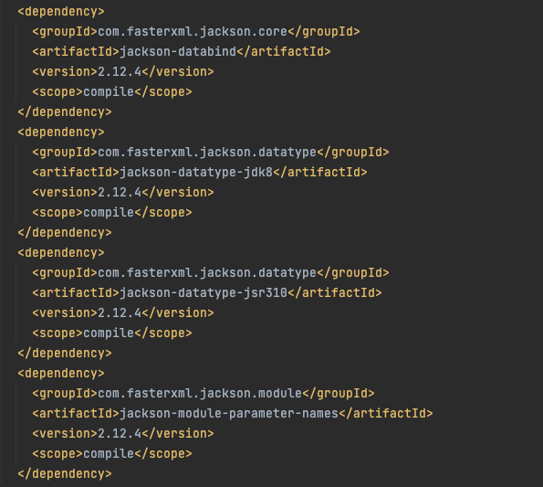

大家好，我是**指北君**。

今天**指北君**将要带**实习生**来熟悉一下 `Spring Boot Json` 输出相关的知识。`Spring Boot` 默认提供了 Gson、Jackson和 JSON-B 3 种 JSON 映射类库。

**指北君**：**实习生**你过来下，今天我给你讲讲 spring boot 中怎么使用json格式数据输出 。

**实习生**：等一下啊，两分钟。

两分钟后，**实习生**过来了。

<!--more-->

**指北君**：哟，还听准时，真就花了2分钟。今天我给你讲的是 spring boot 输出json格式数据的功能。看思维导图，Spring boot 默认提供了3个json格式映射库-- Gson ，Jackson 和 JSON-B。 现在我们比较常见的是 Gson 和 Jackson。我们今天就讲讲这两个比较常见的json映射的应用。


**实习生**：好的。我们现在项目里使用的是Jackson吧，我好像没有看到有那里配置。

**指北君**：是的，Jackson 是spring boot 的默认实现。 我们可以在application.properties 文件里对它进行各种配置。


**实习生**：spring 真的强大啊，这样配置一下，就很方便了啊。

**指北君**：对的，有些个性化的方便，配置一下很方便。我们来看一下 spring boot 怎么做到默认实现的。我看看来看看 spring-boot-starter-web 这个依赖。我们可以看到spring-boot-starter-web中包含一个 spring-boot-starter-json 。


这个starter 起到了配置jackson 为默认解析器的作用。



你看，spring-boot-starter-json 里面都是jackson 相关的依赖库。所以说，jackson就默认成为了spring boot 的json 输出解析器。

**实习生**：懂了，我说我以前怎么没找到到底那里依赖的，没想到是 spring-boot-starter-web 中依赖了 spring-boot-starter-json。 怪我不仔细。

**指北君**：其实你找不到怎么依赖的话，你可以使用IDEA的工具来查看。


你看这不就找到了。 或者说你也可以使用 Maven 命令行查看

```bash
mvn dependency:tree
```


这不，一清二楚啦。

**实习生**：原来如此，又学了一招。

**指北君**：好的，那么我们接下来就看看，怎么使用gson来替换Jackson。我们前面的文章已经讲到过，spring boot 替换一般来说是很简单的。
我们先把 spring-boot-starter-json 排除出去


再添加gson的依赖。


到这里你可以就又疑问了，spring boot 不是一般都是一些starter的处理吗？ 为什么gson没有starter？

我们找到Gson 自动化配置类GsonAutoConfiguration。


GsonAutoConfiguration 类上有 @ConditionalOnClass 的注解，里面配置了Gson.class 。 也就是说我们只要依赖 Gson.class 就能完成配置了。 所以说我们只要依赖gson 就行了。

**实习生**：wc，我原来也是那么想的，要添加一个gson的starter。居然只要引入gson就行了。这就更加简单了。

**指北君**：是啊，我们在写代码的时候，还是要多看看spring boot的代码？毕竟spring boot 主导了我们的项目，学习spring boot 还是非常有用的。 要不我下次跟你讲讲怎么自定义一个starter吧。

**实习生**：好呀好呀，下次就讲那个好了，现在项目里也没啥机会自定义写。

**指北君**：好，我们总结一下今天讲了哪些内容。

1. spring boot 中默认集成了3个json类库，jackson 、gson和 JSON-B。
2. 了解了spring boot jackson的配置
3. 讲述了怎么在项目中查找某个依赖处于那里
4. 如何把 Jackson 替换成 gson

本文的所有示例源代码和完整的思维导图都已上传到了 Github：

> https://github.com/javatechnorth/java-north-sample

欢迎大家 Star 关注，后续会不断更新。