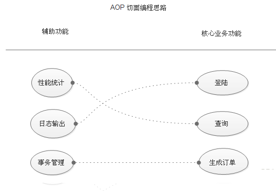
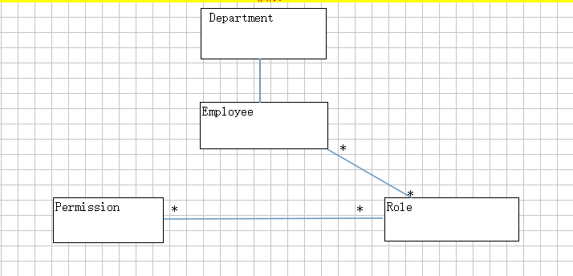

AOP 即 Aspect Oriental Program 面向切面编程

<!--more-->

### 基本思想
AOP 即 Aspect Oriental Program 面向切面编程。首先，在面向切面编程的思想里面，把功能分为核心业务功能，和周边功能。
所谓的核心业务，比如登陆，增加数据，删除数据都叫核心业务
所谓的周边功能，比如性能统计，日志，事务管理等等
周边功能在Spring的面向切面编程AOP思想里，即被定义为切面
在面向切面编程AOP的思想里面，核心业务功能和切面功能分别独立进行开发
然后把切面功能和核心业务功能 “编织” 在一起，这就叫AOP



### 登录验证
将登录验证的代码写成一个方法，做成切面，织入到相关对象中，这样，访问资源之前会先验证是否登录，相关的代码我们只需要编写一份基于RBAC的权限管理
类似于登录验证，AOP还可以做权限验证，思路与上述相同

#### 角色访问控制（RBAC）

简单理解为：谁扮演什么角色， 被允许做什么操作用户对象：user： 当前操作用户角色对象：role：表示权限操作许可权的集合权限对象：permission: 资源操作许可权例子：张三（user） 下载（permission）一个高清无码的种子（资源）， 需要VIP权限（role）张三--->普通用户--->授权---->VIP用户----->下载种子

引入了Role的概念,目的是为了隔离User(即动作主体，Subject)与Privilege(权限，表示对Resource的一个操作，即Operation+Resource)。Role作为一个用户(User)与权限(Privilege)的代理层，解耦了权限和用户的关系，所有的授权应该给予Role而不是直接给User或 Group。

Privilege是权限颗粒，由Operation和Resource组成，表示对Resource的一个Operation。例如，对于新闻的删除操作。Role-Privilege是many-to-many的关系，这就是权限的核心。

两大特征是

1. 由于角色/权限之间的变化比角色/用户关系之间的变化相对要慢得多，减小了授权管理的复杂性，降低管理开销。
2. 灵活地支持企业的安全策略，并对企业的变化有很大的伸缩性。



### 日志记录

当很多方法在开始、结束、抛异常时都需要记录，我们就可以采取上述AOP的思想来简化代码

#### 日志记录最佳实践

- 关键业务操作：比如删除，更新等dml类型的操作的数据，尤其是要审计的日志一定要记录；推荐info级别：查询类的操作不推荐记录日志。

- 异常日志：如果是系统异常，比如网络不通，数据库连接失败等需要记录error日志。

- 业务规则异常：例如数据违反约束，这类推荐记录debug级别日志，不推荐info级别。这类信息正常情况下应该不需要关注，由程序返回值直接来实现，但是如果需要排查bug这部分信息还是很有价值。


1.  在程序开始运行应该以INFO记录程序开始运行的消息。
2.  在程序初始化过程中，如果影响程序主体正常运行错误出现，应该以FATAL记录出现错误的函数名、事件和错误号；如果只是一个不影响程序正常功能的模块出现错误，则应该以ERROR记录出现错误的函数名、模块名、事件和错误号。 
3. 在程序初始化完成后，应该以INFO记录程序初始化完成的消息。 
4. 在函数的入口，如果需要验证参数，则可以以DEBUG的形式输出参数的信息。如果重要参数不正确，则应该以ERROR输出。 
5. 在调用比较成熟的API时，如果失败，则以ERROR记录，并且有错误号记下错误号。
6. 在调用没有经过严格测试的库时，即使返回成功，也要以DEBUG的形式记录下返回的结果。 
7. 以捕获异常时，以ERROR记录下错误。 
8. 在进行数据库操作时，以DEBUG的级别输出执行的SQL词句，对于取回的结果，最好是能打印出所有构造完成的对象的信息。
9. 在与其它程序进行通信时，以DEBUG记录下通信过程中的重要信息。
10. 对程序中的每个线程，它们的初始化完成和开始运行也要以INFO记录下来。
11. 对程序中需要检查运行性能的地方，以DEBUG记录下运行耗时。 
12. 程序正常结束时，和初始化的记录方式相同，对各个模块的卸载采用和加载是一样的处理方式。当程序都卸载完成后以INFO记录程序退出的消息。


#### 你应在适当级别上进行log
如果你遵循了上述第一点的做法，接下来你要对你程序中每一个log语句使用不同的log级别。其中最困难的一个任务是找出这个log应该是什么级别
以下是我的一些建议:

- TRACE level: 如果使用在生产环境中，这是一个代码异味(code smell)。它可以用于开发过程中追踪bug，但不要提交到你的版本控制系统
- DEBUG level: 把一切东西都记录在这里。这在debug过程中最常用到。我主张在进入生产阶段前减少debug语句的数量，只留下最有意义的部分，在调试(troubleshooting)的时候激活。
- INFO level: 把用户行为(user-driven)和系统的特定行为(例如计划任务…)
- NOTICE level: 这是生产环境中使用的级别。把一切不认为是错误的，可以记录的事件都log起来
- WARN level: 记录在这个级别的事件都有可能成为一个error。例如，一次调用数据库使用的时间超过了预设时间，或者内存缓存即将到达容量上限。这可以让你适当地发出警报，或者在调试时更好地理解系统在failure之前做了些什么
- ERROR level: 把每一个错误条件都记录在这。例如API调用返回了错误，或是内部错误条件
- FATAL level: 末日来了。它极少被用到，在实际程序中也不应该出现多少。在这个级别上进行log意味着程序要结束了。例如一个网络守护进程无法bind到socket上，那么它唯一能做的就只有log到这里，然后退出运行。

记住，在你的程序中，默认的运行级别是高度可变的。例如我通常用INFO运行我的服务端代码，但是我的桌面程序用的是DEBUG。这是因为你很难在一台你没有接入权限的机器上进行调试，但你在做用户服务时，比起教他们怎么修改log level再把生成的log发给你，我的做法可以让你轻松得多。当然你可以有其他的做法:)


#### 你应该写有意义的log

这可能是最重要的建议了。没有什么比你深刻理解程序内部，却写出含糊的log更糟了。
在你写日志信息之前，总要提醒自己，有突发事件的时候，你唯一拥有的只有来自log文件，你必须从中明白发生了什么。这可能就是被开除和升职之间的微妙的差距。
当开发者写log的时候，它(log语句)是直接写在代码环境中的，在各种条件中我们应该写入基于当前环境的信息。不幸的是，在log文件中并没有这些环境，这可能导致这些信息无法被理解。
解决这个情况(在写warn和error level时尤为重要)的一个方法是，添加辅助信息到log信息中，如果做不到，那么改为把这个操作的作用写下。
还有，不要让一个log信息的内容基于上一个。这是因为前面的信息可能由于(与当前信息)处于不同的类别或者level而没被写入。更坏的情况是，它因多线程或异步操作，在另一个地方(或是以另一方式)出现。

#### 日志信息应该用英语

这个建议可能有点奇怪，尤其是对法国佬(French guy)来说。我还是认为英语远比法语更简炼，更适应技术语言。如果一个信息里面包含超过50%的英语单词，你有什么理由去用法语写log呢

把英法之争丢一边，下面是这个建议背后的原因：

英语意味着你的log是用ASCII编码的。这非常重要，因为你不会真正知道log信息会发生什么，或是它被归档前经过何种软件层和介质。如果你的信息里面使用了特殊字符集，乃至UTF-8，它可能并不会被正确地显示(render)，更糟的是，它可能在传输过程中被损坏，变得不可读。不过这还有个问题，log用户输入时，可能有各种字符集或者编码。

如果你的程序被大多数人使用，而你又没有足够的资源做国际化，英语会成为你的不二之选。如果你有国际化，那么让界面与终端用户更亲近(closer)(这通常不会是你的log)

如果你国际化了你的log(例如所有的warning和error level信息)，给他们一个特定的有意义的错误码。这样，用户做与语言无关的搜索，找到相关信息。这种良好的模式已经在虚拟内存(VMS)操作系统中应用了很久，而我必须承认它非常有用。如果你曾经设计过这种模式，你还可以试试这种模式: APP-S-CODE 或者 APP-SSUB-CODE，它们分别代表:

APP: 应用程序的3字缩写S: 严重程度的1字缩写(例如D代表debug，I代表info)
SUB: 这个code所从属的应用程序的子部分
CODE: 一个数字代号，指定这个问题中的错误


#### 日志不宜太多或太少
这听着貌似很愚蠢。log的数量是有一个合适的平衡的。
太多的log会使从中获得有价值的东西变得困难。当人工地浏览这种十分混乱的log，尝试调试产品在早上3点的一个问题可不是一个好事。
太少的log，你可能无法调试问题: 调试就像在拼一个困难的拼图，你需要得到足够的拼块。
不幸的是，这没有魔法般的规则去知道应该log些什么。所以需要严格地遵从第一第二点，程序可以变得很灵活，
轻松地增减log的长度(verbosity)。

解决这个问题的一个方法是，在开发过程中尽可能多地进行log(不要被加入用于程序调试的log所迷惑)。当应用程序进入生产过程时，对生成的log进行一次分析，根据所发现的问题增减log语句。尤其是在调试时，在你需要的部分，你可以有更多的上下文或logging，确保在下一个版本中加入这些语句(可以的话，同时解决它来让这个问题在记忆中保持新鲜)。当然，这需要运维人员和开发者之间大量的交流。

这是一个复杂的任务，但是我推荐你重构logging语句，如你重构代码一样多。这样可以在产品的log和它的log语句的修改中有一个紧密的反馈循环。如果你的组织有一个连续的交付进程的话，它会十分有效，正如持续的重构。

Logging语句是与代码注释同级的代码元数据。保持logging语句与代码相同步是很重要的。没什么比调试时获得与所运行的代码毫无关系的信息更糟了。

#### 你应该考虑阅读者

为什么要对应用程序做log
唯一的答案是，在某一天会有人去读它(或是它的意义)。更重要的是，猜猜谁会读它，这是很有趣的事。对于不同的”谁”，你将要写下的log信息的内容，上下文，类别和level会大不同。
这些”谁”包括:

- 一个尝试自己解决问题的终端用户(想象一个客户端或桌面程序)

- 一个在调试产品问题的系统管理员或者运维工程师
- 一个在开发中debug，或者在解决产品问题的开发者

开发者了解程序内部，所以给他的log信息可以比给终端用户的复杂得多。为你的目标阅读者调整你的表达方式，乃至为此加入额外的类别(dedicate separate catagories)。

#### 你不应该只为调试而log

- 正如log会有不同的阅读者，它也有不同的使用理由。即便调试是最显而易见的阅读log的目的，你同样可以有效地把log用在:
  审查: 有时商业上会有需求。这可以获取与管理或者合法用户的有意义的事件。通常会有一些语句描述这个系统中的用户在做些什么(例如谁登录了，谁在编辑……)
- 建档: log是打上了时间戳的(有时是微妙级的)，可以成为一个为程序各部分建档的好工具。例如记录一个操作的开始和结束，你可以自动化(通过解析log)或是在调试中，进行性能度量，而不需要把这些度量加到程序中。
- 统计: 如果你每次对一个特定事件(例如特定的错误或事件)进行log，你可以对运行中的程序(或用户行为)进行有趣的统计。这可以添加(hook)到一个警报系统中去连续地发现大量error。

### 统一异常处理

在Web接口开发中，我们希望我们的接口函数运行过程中，即使抛出了异常，也能给客户端相应数据，告诉客户请求出错或者服务器出错，而不是直接宕机不去相应客户，并且我们还希望，我们抛异常之后相应数据格式要统一，此时便可以使用AOP思想做统一的异常处理。

首先看我们添加一个girl的这段代码

```java
@PostMapping(value = "/girl")
public Girl addGirl(@Valid Girl girl, BindingResult bindingResult) {
    if (bindingResult.hasErrors()) {
        logger.error(bindingResult.getFieldError().getDefaultMessage());
        return null;
    }
    return girlRepository.save(girl);
}
```

有错误时返回null，而成功是返回girl。这边的问题是格式不统一。 如果我们定义"code"，"msg"，和"data"是server返回给client端的三个field，这样client端因为统一的格式，能够更容易的处理之后的操作。

```java
{
    "code": -1,
    "msg": "some error message here",
    "data": null
}
{
    "code": 0
    "msg": "success",
    "data": {
        "id": 20,
        "cupSize": "B",
        "age": 25
    }
}
```

我们先来创建一个Result对象并包含这三个field

```java
public class Result<T> {
    private int code;
    private String msg;
    private T data;
    public int getCode() {
    	return code;
    }
    public String getMsg() {
    	return msg;}
    public T getData() {
    	return data;
    }
    public void setCode(int code) {
    	this.code = code;
    }
    public void setMsg(String msg) {
    	this.msg = msg;
    }
    public void setData(T data) {
    	this.data = data;
    }
}
```

然后重新refactor一下这段添加girl的代码

```java
@PostMapping(value = "/girl")
public Result addGirl(@Valid Girl girl, BindingResult bindingResult) {
    Result result = new Result();
    if (bindingResult.hasErrors()) {
        result.setCode(-1);
        result.setMsg(bindingResult.getFieldError().getDefaultMessage());
        return result;
    }
    result.setCode(0);
    result.setMsg("success");
    result.setData(girlRepository.save(girl));
    return result;
}
```

我们看到每次都是做很多的set操作还是很繁琐，那就进一步refactor一下。 建一个ResultUtil类

```java
import com.zfu.domain.Result;
public class ResultUtil {
    public static Result generateSuccessResult(final Object object) {
        Result result = new Result();
        result.setCode(0);
        result.setMsg("success");
        result.setData(object);
        return result;
    }
    public static Result generateErrorResult(final int errorCode, final String errorMsg) {
        Result result = new Result();
        result.setCode(errorCode);
        result.setMsg(errorMsg);
        return result;
    }
}
```

有了这个类的帮助，我们再进一步改进一下添加一个girl这段代码

```java
@PostMapping(value = "/girl")
public Result addGirl(@Valid Girl girl, BindingResult bindingResult) {
    if (bindingResult.hasErrors()) {
   		return ResultUtil.generateErrorResult(-1,
   	 	bindingResult.getFieldError().getDefaultMessage());
    }
    return ResultUtil.generateSuccessResult(girlRepository.save(girl));
}
```

这时我们有一个需求，将女生按年龄分类。假如她的年龄小于等于12，返回你还在读小学吧；假如他的年龄小于等于17，返回你还在读中学吧。 为了满足这个需求，我们可以先在service类里写一个方法

```java
/**
* if age <= 12,
* 返回你还在读小学吧
* else if age <= 17,
* 返回你还在读中学吧
* else
* do something...
*/
public void classifyGirlsByAge(int id) throws Exception {
    Girl girl = girlRepository.findOne(id);
    int age = girl.getAge();
    if (age <= 12) {
    	throw new Exception("你还在读小学吧");
    } else if (age <= 17) {
    	throw new Exception("你还在读中学吧");
    }
}
```

然后在controller类里调用这个service的方法，来响应这个请求。

```java
@GetMapping(value = "girl/age/{id}")
public void classifyGirlsByAge(@PathVariable("id") int id) throws Exception {
    girlService.classifyGirlsByAge(id);
}
```

然后在controller这一层throw一个exception，会导致server挂掉。那我们怎么handle这个情况呢。 先创建一个ResultEnum来枚举Exception类型的信息\

```java
public enum ResultEnum {
    UNKNOWN_ERROR(-1, "unknown error"),
    SUCCESS(0, "success"),
    PRIMARY_SCHOOL(100, "你还在上小学吧"),
    MIDDLE_SCHOOL(101, "你还在上中学吧");
    private int code;
    private String msg;
    ResultEnum(int code, String msg) {
    	this.code = code;
   		this.msg = msg;
    }
    public int getCode() {
        return code;
    }
    public String getMsg() {
        return msg;
    }
}
```


再写一个ExceptionHandler，带上@ControllerAdvice 这个Annotation来handle那些runtime exception。

```java
import com.zfu.domain.Result;
import com.zfu.domain.ResultEnum;
import com.zfu.exception.GirlException;
import com.zfu.utils.ResultUtil;
import org.slf4j.Logger;
import org.slf4j.LoggerFactory;
import org.springframework.web.bind.annotation.ControllerAdvice;
import org.springframework.web.bind.annotation.ExceptionHandler;
import org.springframework.web.bind.annotation.ResponseBody;
@ControllerAdvice
public class GirlExceptionHandler {
    private static final Logger logger = LoggerFactory.getLogger(GirlExceptionHandler.class);
    @ExceptionHandler(value = Exception.class)
        @ResponseBody
    public Result handle(Exception e) {
        if (e instanceof GirlException) {
            GirlException girlException = (GirlException) e;
            return ResultUtil.generateErrorResult(girlException.getCode(),
            girlException.getMsg());
        }
        logger.error(e.getMessage());
        return ResultUtil.generateErrorResult(ResultEnum.UNKNOWN_ERROR.getCode(),
        ResultEnum.UNKNOWN_ERROR.getMsg());
    }
}
```


