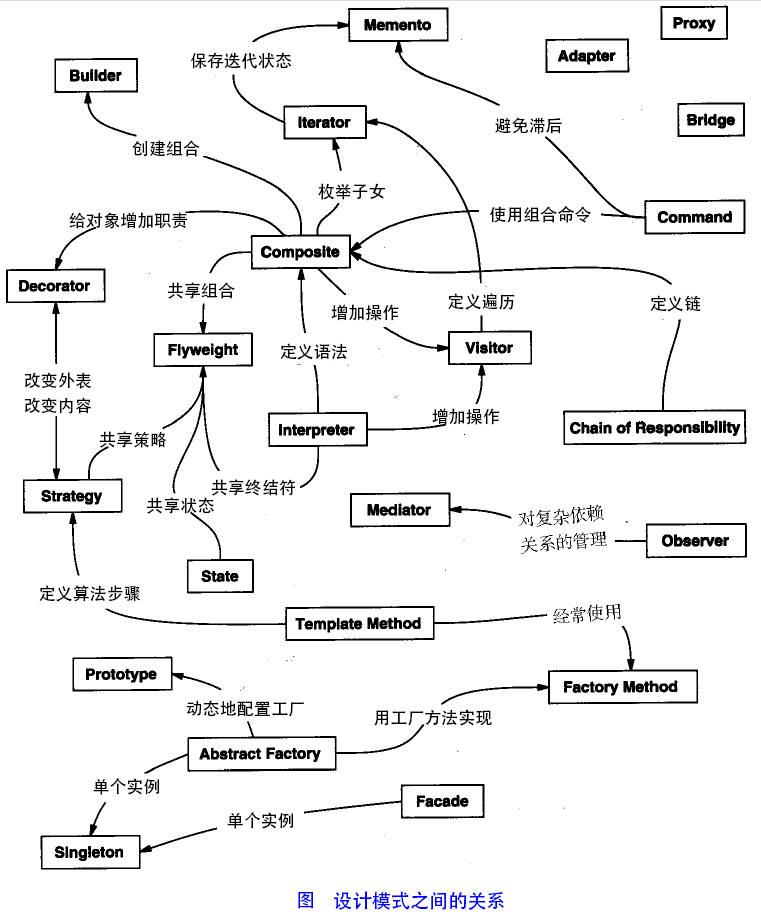
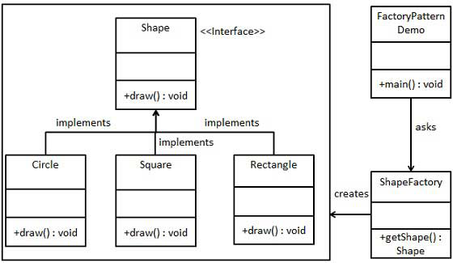

设计模式面试内容

<!--more-->

### OOP五大原则SOLID

S.O.L.I.D是面向对象设计和编程(OOD&OOP)中几个重要编码原则(Programming Priciple)的首字母缩写。

| 设计原则 | 英文名 | 中文名 |
| -- | ----- | --|
| SRP | The Single Responsibility Principle | 单一责任原则 |
|OCP |The Open Closed Principle |开放封闭原则|
|LSP |The Liskov Substitution Principle |里氏替换原则|
|DIP |The Dependency Inversion Principle |依赖倒置原则|
|ISP |The Interface Segregation Principle |接口分离原则|

#### 单一责任原则
当需要修改某个类的时候原因有且只有一个（THERE SHOULD NEVER BE MORE THAN ONE REASON FOR ACLASS TO CHANGE）。换句话说就是让一个类只做一种类型责任，当这个类需要承当其他类型的责任的时候，就需要分解这个类。

#### 开放封闭原则
开闭原则的意思是：对扩展开放，对修改关闭。在程序需要进行拓展的时候，不能去修改原有的代码，实现一个热插拔的效果。简言之，是为了使程序的扩展性好，易于维护和升级。想要达到这样的效果，我们需要使用接口和抽象类，后面的具体设计中我们会提到这点。

#### 里氏替换原则
里氏代换原则是面向对象设计的基本原则之一。 里氏代换原则中说，任何基类可以出现的地方，子类一定可以出现。LSP 是继承复用的基石，只有当派生类可以替换掉基类，且软件单位的功能不受到影响时，基类才能真正被复用，而派生类也能够在基类的基础上增加新的行为。里氏代换原则是对开闭原则的补充。实现开闭原则的关键步骤就是抽象化，而基类与子类的继承关系就是抽象化的具体实现，所以里氏代换原则是对实现抽象化的具体步骤的规范。

#### 依赖倒置原则
1. 高层模块不应该依赖于低层模块，二者都应该依赖于抽象
2. 抽象不应该依赖于细节，细节应该依赖于抽象

#### 接口分离原则
这个原则的意思是：使用多个隔离的接口，比使用单个接口要好。它还有另外一个意思是：降低类之间的耦合度。由此可见，其实设计模式就是从大型软件架构出发、便于升级和维护的软件设计思想，它强调降低依赖，降低耦合。

这几条原则是非常基础而且重要的面向对象设计原则。正是由于这些原则的基础性，理解、融汇贯通这些原则需要不少的经验和知识的积累。上述的图片很好的注释了这几条原则。

### 二、设计模式

设计模式（Design pattern）代表了最佳的实践，通常被有经验的面向对象的软件开发人员所采用。设计模式是软件开发人员在软件开发过程中面临的一般问题的解决方案。这些解决方案是众多软件开发人员经过相当长的一段时间的试验和错误总结出来的。
设计模式是一套被反复使用的、多数人知晓的、经过分类编目的、代码设计经验的总结。使用设计模式是为了重用代码、让代码更容易被他人理解、保证代码可靠性。 毫无疑问，设计模式于己于他人于系统都是多赢的，设计模式使代码编制真正工程化，设计模式是软件工程的基石，如同大厦的一块块砖石一样。项目中合理地运用设计模式可以完美地解决很多问题，每种模式在现实中都有相应的原理来与之对应，每种模式都描述了一个在我们周围不断重复发生的问题，以及该问题的核心解决方案，这也是设计模式能被广泛应用的原因。

|序号|模式 & 描述包括|包括|
| -- | ------ | --|
| 1 |创建型模式这些设计模式提供了一种在创建对象的同时隐藏创建逻辑的方式，而不是使用 new 运算符直接实例化对象。这使得程序在判断针对某个给定实例需要创建哪些对象时更加灵活。|工厂模式（Factory Pattern）抽象工厂模式（Abstract FactoryPattern）单例模式（Singleton Pattern）建造者模式（BuilderPattern）原型模式（Prototype Pattern）|
| 2 | 结构型模式这些设计模式关注类和对象的组合。继承的概念被用来组合接口和定义组合对象获得新功能的方式。| 适配器模式（Adapter Pattern）桥接模式（Bridge Pattern）过滤器模式（Filter、Criteria Pattern）组合模式（Composite Pattern）装饰器模式（Decorator Pattern）外观模式（Facade Pattern）享元模式（Flyweight Pattern）代理模式（Proxy Pattern） |
| 3 | 行为型模式这些设计模式特别关注对象之间的通信。| 责任链模式（Chain of Responsibility Pattern）命令模式（Command Pattern）解释器模式（Interpreter Pattern）迭代器模式（Iterator Pattern）中介者模式（Mediator Pattern）备忘录模式（Memento Pattern）观察者模式（Observer Pattern）状态模式（State Pattern）空对象模式（Null Object Pattern）策略模式（Strategy Pattern）模板模式（Template Pattern）访问者模式（Visitor Pattern） |

下面用一个图片来整体描述一下设计模式之间的关系：



### 代理模式

1. 其他对象：目标对象，想要访问的对象，常被称为被委托对象或被代理对象。

2. 提供一种代理：这里"一种"两个字比较重要，为什么不是提供一个呢？一种代表了某一类，即代理类和被代理类必须实现同一接口，这个接口下
   的所有实现类都能被代理访问到，其实只是单纯的为了 实现代理访问功能，代理类不实现任何接口也能完成，不过针对于面向接口的编程，这种方式 更易于维护和扩展，代理类实现接口，不管目标对象怎么改或改成谁，代理类不需要任何修改 ，而且任何目标对象能使用的地方都能用代理去替换。

3. 通过代理访问目标对象：代理类需要持有目标对象的引用，这样用户可以通过代理类访问目标对象，实现 了用户与目标对象的解耦。 

4. 访问：访问二字说明代理对象的目的是访问被代理类，业务逻辑的具体执行与其无关，由被代理对象完成。

5. 为什么要通过代理来访问：设计模式都是为了解决某一类的问题，可能目标对象不想让该用户访问或者是 该用户无法访问到目标对象，这样就需要一个第三者来建立他们的联系，如代理服务器情景， 被访问的服务器设置防火墙过滤掉某些地址的访问，这时用户就可以通过一个代理服务器来访 问目标，使得目标服务器不用对外暴露细节，用户也能访问到想访问的数据。 
6. 代理类功能增强：代理对象能直接访问到目标对象，这样它就能在调用目标对象的某个方法之前做一个预 处理，在调用方法之后进行一些结尾工作，这样就对目标对象的方法进行了增强。但是我们不 能说代理模式提供对象功能的增强，它的设计初衷是对代理对象施加控制，只是这种设计思路 能达到功能增强的目的。

#### 静态代理

静态代理模式就是如下图所示，构造三个类实现他们的关系。

静态代理由程序员创建或特定工具自动生成源代码，也就是在编译时就已经将接口，被代理类，代理类等确定下来。在程序运行之前，代理类的.class文件就已经生成。


静态代理分析:静态代理确实处理了代码污染的问题;
问题:

1. 重复的代码仍然分散在了各个方法中;
2. 需要为每一个真实对象写一个代理对象;

#### 动态代理

代理类在程序运行时创建的代理方式被成为动态代理。 我们上面静态代理的例子中，代理类(studentProxy)是自己定义好的，在程序运行之前就已经编译完成。然而动态代理，代理类并不是在Java代码中定义的，而是在运行时根据我们在Java代码中的“指示”动态生成的。相比于静态代理， 动态代理的优势在于可以很方便的对代理类的函数进行统一的处理，而不用修改每个代理类中的方法。也就是说，有了动态代理，我们只需要编写一份开始事务，提交事务的代码，然后再指明哪些方法需要事务就可以了，程序会自动地帮我们生成代理类

#### JDK动态代理

基于java的反射，适用于有接口的类

#### CGLIB动态代理

基于ASM字节码操纵技术，适用于没有接口的类


### 工厂模式

#### 简单工厂
简单工厂模式不能说是一个设计模式，说它是一种编程习惯可能更恰当些。因为它至少不是Gof23种设计模式之一。但它在实际的编程中经常被用到，而且思想也非常简单，可以说是工厂方法模式的一个引导，所以我想有必要把它作为第一个讲一下。

个简单的软件应用场景，一个软件系统可以提供多个外观不同的按钮（如圆形按钮、矩形按钮、菱形按钮等），这些按钮都源自同一个基类，不过在继承基类后不同的子类修改了部分属性从而使得它们可以呈现不同的外观，如果我们希望在使用这些按钮时，不需要知道这些具体按钮类的名字，只需要知道表示该按钮类的一个参数，并提供一个调用方便的方法，把该参数传入方法即可返回一个相应的按钮对象，此时，就可以使用简单工厂模式。

模式定义 简单工厂模式(Simple Factory Pattern)：又称为静态工厂方法(Static Factory Method)模式，它属于类创建型模式。在简单工厂模式中，可以根据参数的不同返回不同类的实例。简单工厂模式专门定义一个类来负责创建其他类的实例，被创建的实例通常都具有共同的父类。

步骤 1：创建一个接口:

Shape.java

```java
public interface Shape {
	void draw();
}
```

步骤 2：创建实现接口的实体类。

Rectangle.java

```java
public class Rectangle implements Shape {
    @Override
    public void draw() {
    	System.out.println("Inside Rectangle::draw() method.");
    }
}
```

Square.java

```java
public class Square implements Shape {
    @Override
    public void draw() {
    	System.out.println("Inside Square::draw() method.");
    }
}
```

Circle.java

```java
public class Circle implements Shape {
    @Override
    public void draw() {
    	System.out.println("Inside Circle::draw() method.");
    }
}
```




步骤 3：创建一个工厂，生成基于给定信息的实体类的对象。
ShapeFactory.java

```java
public class ShapeFactory {
    //使用 getShape 方法获取形状类型的对象
    public Shape getShape(String shapeType){
        if(shapeType == null){
        	return null;
        }
        if(shapeType.equalsIgnoreCase("CIRCLE")){
        	return new Circle();
        } else if(shapeType.equalsIgnoreCase("RECTANGLE")){
        	return new Rectangle();
        } else if(shapeType.equalsIgnoreCase("SQUARE")){
        	return new Square();
        }
        return null;
    }
}
```

步骤 4 使用该工厂，通过传递类型信息来获取实体类的对象。

FactoryPatternDemo.java

```java
public class FactoryPatternDemo {
    public static void main(String[] args) {
        ShapeFactory shapeFactory = new ShapeFactory();
        //获取 Circle 的对象，并调用它的 draw 方法
        Shape shape1 = shapeFactory.getShape("CIRCLE");
        //调用 Circle 的 draw 方法
        shape1.draw();
        //获取 Rectangle 的对象，并调用它的 draw 方法
        Shape shape2 = shapeFactory.getShape("RECTANGLE");
        //调用 Rectangle 的 draw 方法
        shape2.draw();
        //获取 Square 的对象，并调用它的 draw 方法
        Shape shape3 = shapeFactory.getShape("SQUARE");
        //调用 Square 的 draw 方法
        shape3.draw();
    }
}
```


### ### 观察者模式

定义：当对象间存在一对多关系时，则使用观察者模式（Observer Pattern）。比如，当一个对象被修改时，则会自动通知它的依赖对象。观察者模式属于行为型模式。
意图：定义对象间的一种一对多的依赖关系，当一个对象的状态发生改变时，所有依赖于它的对象都得到通知并被自动更新。
主要解决：一个对象状态改变给其他对象通知的问题，而且要考虑到易用和低耦合，保证高度的协作。
何时使用：一个对象（目标对象）的状态发生改变，所有的依赖对象（观察者对象）都将得到通知，进行广播通知。

```java
/**
 * 被观察者，也就是微信公众号服务
 * 实现了Observerable接口，对Observerable接口的三个方法进行了具体实现
 * @author jstao
 *
 */
public class WechatServer implements Observerable {
    //注意到这个List集合的泛型参数为Observer接口，设计原则：面向接口编程而不是面向实现编程
    private List<Observer> list;
    private String message;
    public WechatServer() {
    	list = new ArrayList<Observer>();
    }
    @Override
    public void registerObserver(Observer o) {
    	list.add(o);
    }
    @Override
    public void removeObserver(Observer o) {
        if(!list.isEmpty())
        	list.remove(o);
        }
    //遍历
    @Override
    public void notifyObserver() {
        for(int i = 0; i < list.size(); i++) {
            Observer oserver = list.get(i);
            oserver.update(message);
        }
    }
    public void setInfomation(String s) {
        this.message = s;
        System.out.println("微信服务更新消息： " + s);
        //消息更新，通知所有观察者
        notifyObserver();
    }
}
```

