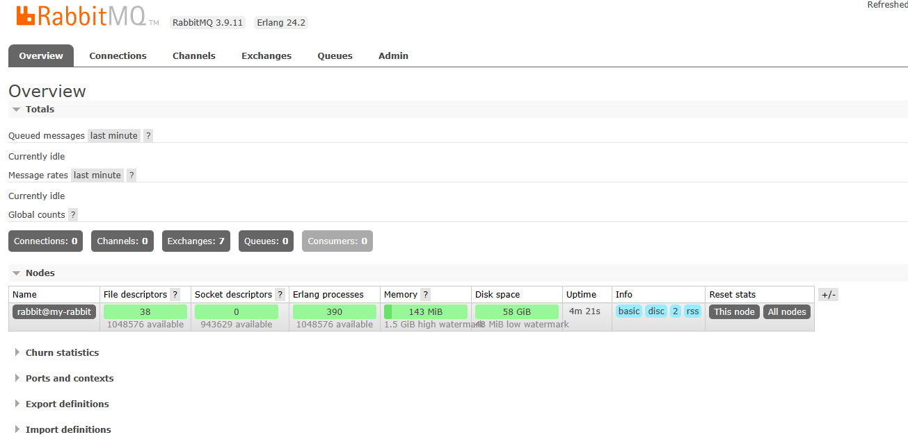
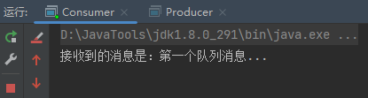

大家好，我是指北君。

在工作中经常会用到消息队列处理各种问题，今天指北君带领大家来学一个很常用到的技术-RabbitMQ；接下来还会有关于RabbitMQ的系列教程，对你有帮助的话记得关注哦~

<!--more-->

### RabbitMQ是什么

**队列**：一种数据结构，先进先出。

**消息队列**：简单的说就是用来进行消息传输的队列。

**消息中间件**：简单的说就是用来传输消息的中间载体，就是将你的信息发送到接受方，它并不关心发送的数据是什么。RabbitMQ就是一个消息中间件。

### RabbitMQ的特点

- 可靠性。支持持久化，传输确认，发布确认等保证了MQ的可靠性。
- 灵活的分发消息策略。这应该是RabbitMQ的一大特点。在消息进入MQ前由Exchange(交换机)进行路由消息。分发消息策略有：简单模式、工作队列模式、发布订阅模式、路由模式、通配符模式。
- 支持集群。多台RabbitMQ服务器可以组成一个集群，形成一个逻辑Broker。
- 多种协议。RabbitMQ支持多种消息队列协议，比如 STOMP、MQTT 等等。
- 支持多种语言客户端。RabbitMQ几乎支持所有常用编程语言，包括 Java、.NET、Ruby 等等。
- 可视化管理界面。RabbitMQ提供了一个易用的用户界面，使得用户可以监控和管理消息 Broker。
- 插件机制。RabbitMQ提供了许多插件，可以通过插件进行扩展，也可以编写自己的插件。

### 为什么使用消息队列

1. **解耦**，模块间的通信使用消息队列进行，降低模块之间的耦合度。
2. **异步**，模块A处理完核心业务之后，发消息给模块B，就可以直接返回给客户端，提高性能。
3. **削峰**，短时间内有大量请求，可以通过消息队列来逐个处理，防止系统宕机。

### Hello World

首先，安装RabbitMQ，可直接使用docker安装一个。

docker 地址：[rabbitmq Tags | Docker Hub](https://hub.docker.com/_/rabbitmq/tags) 

```bash
# 拉取镜像
docker pull rabbitmq:management

# 启动容器
docker run -id --hostname my-rabbit \
	--name rabbitmq \
	-p 15672:15672 \
	-p 5672:5672 \
	-e RABBITMQ_DEFAULT_USER=admin \
	-e RABBITMQ_DEFAULT_PASS=admin \
	rabbitmq:management
```

然后在网页访问： http://服务器的ip:15672，输入账号密码。 **记得开放端口** 

看到此页面代表安装成功



准备就绪，先写个Hello World

1. 导入pom依赖

   ```xml
    <dependency>
        <groupId>org.springframework.boot</groupId>
        <artifactId>spring-boot-starter-amqp</artifactId>
   </dependency>
   ```

2. 准备工具类

   ````java
   public class ConnectionUtils {
   
       public static Connection getConnection() {
           ConnectionFactory factory = new ConnectionFactory();
           factory.setHost("1.15.88.28");
           factory.setPort(5672);
           factory.setUsername("admin");
           factory.setPassword("admin");
           factory.setVirtualHost("/");
           try {
               return factory.newConnection();
           } catch (IOException | TimeoutException e) {
               e.printStackTrace();
           }
           return null;
       }
   }
   ````

3. 生产者

   ```java
   public class Producer {
       // 声明队列的名字
       private static final String QUEUE_NAME = "queue_helloworld_1";
   
       public static void main(String[] args) throws IOException, TimeoutException {
           // 1. 获取连接
           Connection connection = ConnectionUtils.getConnection();
           // 2. 创建数据传输通道
           Channel channel = connection.createChannel();
           // 3. 声明队列
           channel.queueDeclare(QUEUE_NAME, false, false, false, null);
           // 4. 发送数据到队列
           channel.basicPublish("", QUEUE_NAME, MessageProperties.PERSISTENT_TEXT_PLAIN, "第一个队列消息...".getBytes());
           // 5. 关闭通道
           channel.close();
           // 6. 关闭连接
           connection.close();
       }
   }
   ```

4. 消费者

   ```java
   public class Consumer {
       // 声明队列的名字
       private static final String QUEUE_NAME = "queue_helloworld_1";
   
       public static void main(String[] args) throws IOException, TimeoutException {
           // 1. 获取连接
           Connection connection = ConnectionUtils.getConnection();
           // 2. 创建通道
           Channel channel = connection.createChannel();
           // 3. 声明队列
           channel.queueDeclare(QUEUE_NAME, false, false, false, null);
           // 4. 声明消费者
           DefaultConsumer defaultConsumer = new DefaultConsumer(channel) {
               @Override
               public void handleDelivery(String consumerTag, Envelope envelope, AMQP.BasicProperties properties, byte[] body) throws IOException {
                   System.out.println("接收到的消息是：" + new String(body));
                   channel.basicAck(envelope.getDeliveryTag(), false);
               }
           };
           // 5. 绑定消费者
           channel.basicConsume(QUEUE_NAME, false, defaultConsumer);
       }
   }
   ```

5. 测试

   1. 先启动消费者

   2. 再启动生产者

   3. 可以看到消费者的控制台打印出 生产者传递的消息

      


### 小结

本文到这里就结束了，简单介绍了一下RabbitMQ是什么，以及RabbitMQ的安装；

后续指北君还会继续更新RabbitMQ的系列文章，感兴趣的小伙伴持续关注哦~
