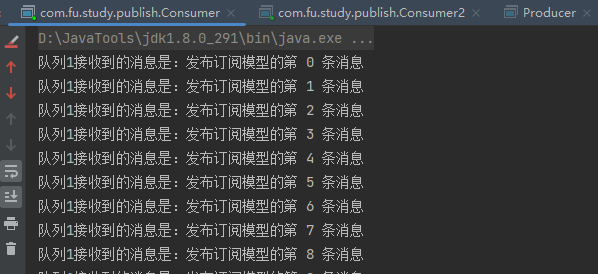
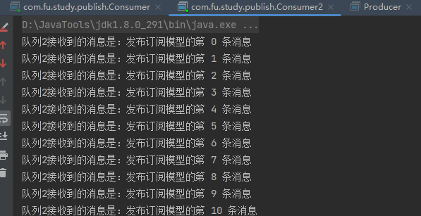

大家好，我是指北君。

今天指北君带领大家接着学习RabbitMQ，了解RabbitMQ的五大通信模型之一的发布订阅模型；接下来还会有关于RabbitMQ的系列教程，对你有帮助的话记得关注哦~

<!--more-->

### 发布订阅模型

上一篇文章中，简单的介绍了一下RabbitMQ的work模型。这篇文章来学习一下RabbitMQ中的发布订阅模型。

发布订阅模型(Publish/Subscribe)：简单的说就是队列里面的消息会被多个消费者同时接受到，消费者接收到的信息一致。

发布订阅模型适合于做模块之间的异步通信。


### 适用场景

1. 发送并记录日志信息
2. springcloud的config组件里面通知配置自动更新
3. 缓存同步
4. 微信订阅号

### 演示

1. 生产者

   ```java
   public class Producer {
       private static final String EXCHANGE_NAME = "exchange_publish_1";
   
       public static void main(String[] args) throws IOException, TimeoutException {
           Connection connection = ConnectionUtils.getConnection();
           Channel channel = connection.createChannel();
           // 声明交换机
           channel.exchangeDeclare(EXCHANGE_NAME, "fanout");
           // 发送消息到交换机
           for (int i = 0; i < 100; i++) {
               channel.basicPublish(EXCHANGE_NAME, "", null, ("发布订阅模型的第 " + i + " 条消息").getBytes());
           }
           // 关闭资源
           channel.close();
           connection.close();
       }
   }
   ```

2. 消费者

   ````java
   // 消费者1
   public class Consumer {
       private static final String QUEUE_NAME = "queue_publish_1";
       private static final String EXCHANGE_NAME = "exchange_publish_1";
   
       public static void main(String[] args) throws IOException, TimeoutException {
           Connection connection = ConnectionUtils.getConnection();
           Channel channel = connection.createChannel();
           // 声明队列
           channel.queueDeclare(QUEUE_NAME, false, false, false, null);
           // 声明交换机
           channel.exchangeDeclare(EXCHANGE_NAME, "fanout");
           // 将队列绑定到交换机
           channel.queueBind(QUEUE_NAME, EXCHANGE_NAME, "");
           DefaultConsumer defaultConsumer = new DefaultConsumer(channel) {
               @Override
               public void handleDelivery(String consumerTag, Envelope envelope, AMQP.BasicProperties properties, byte[] body) throws IOException {
                   System.out.println("队列1接收到的消息是：" + new String(body));
               }
           };
           channel.basicConsume(QUEUE_NAME, true, defaultConsumer);
       }
   }
   ````

   ```java
   // 消费者2
   public class Consumer2 {
       private static final String QUEUE_NAME = "queue_publish_2";
       private static final String EXCHANGE_NAME = "exchange_publish_1";
   
       public static void main(String[] args) throws IOException, TimeoutException {
           Connection connection = ConnectionUtils.getConnection();
           Channel channel = connection.createChannel();
           // 声明队列
           channel.queueDeclare(QUEUE_NAME, false, false, false, null);
           // 声明交换机
           channel.exchangeDeclare(EXCHANGE_NAME, "fanout");
           // 将队列绑定到交换机
           channel.queueBind(QUEUE_NAME, EXCHANGE_NAME, "");
           DefaultConsumer defaultConsumer = new DefaultConsumer(channel) {
               @Override
               public void handleDelivery(String consumerTag, Envelope envelope, AMQP.BasicProperties properties, byte[] body) throws IOException {
                   System.out.println("队列2接收到的消息是：" + new String(body));
               }
           };
           channel.basicConsume(QUEUE_NAME, true, defaultConsumer);
       }
   }
   ```

3. 测试

   先启动2个消费者，再启动生产者

   

   



**可以看出来消费者1和消费者2接收到的消息是一模一样的**，每个消费者都收到了生产者发送的消息；

发布订阅模型，用到了一个新的东西-交换机，这里也解释一下相关方法的参数：

```java
// 声明交换机
channel.exchangeDeclare(EXCHANGE_NAME, "fanout");

// 该方法的最多参数的重载方法是：
Exchange.DeclareOk exchangeDeclare(String exchange,
                                    BuiltinExchangeType type,
                                    boolean durable,
                                    boolean autoDelete,
                                    boolean internal,
                                    Map<String, Object> arguments) throws IOException;

/**
 *  param1：exchange，交换机名称
 *  param2：type，交换机类型；直接写 string效果一致；内置了4种交换机类型：
 *			direct（路由模式）、fanout（发布订阅模式）、
 *			topic（topic模式-模糊匹配）、headers（标头交换，由Headers的参数分配，不常用）
 *  param3：durable，是否持久化交换机   false：默认值，不持久化
 *  param4：autoDelete，没有消费者使用时，是否自动删除交换机   false：默认值，不删除
 *  param5：internal，是否内置,如果设置 为true,则表示是内置的交换器, 客户端程序无法直接发送消息到这个交换器中, 只能通过交换器路由到交换器的方式  false：默认值，允许外部直接访问
 *  param6：arguments，交换机的一些其他属性，默认值为 null
 */
```

```java
// 将队列绑定到交换机
channel.queueBind(QUEUE_NAME, EXCHANGE_NAME, "");
/**
 *  param1：destination，目的地，队列的名字
 *  param2：source，资源，交换机的名字
 *  param3：routingKey，路由键（目前没有用到routingKey，填 "" 即可）
 */
```

### 小结

本文到这里就结束了，介绍了RabbitMQ通信模型中的发布订阅模型，适合于做模块之间的异步通信。

后续指北君还会继续更新RabbitMQ的系列文章，感兴趣的小伙伴持续关注哦~

>[RabbitMQ（一）hello world，链接未补充]()
>
>[RabbitMQ（二）通信模型之work模型，链接未补充]()
