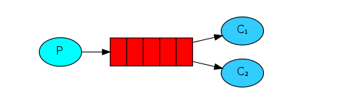
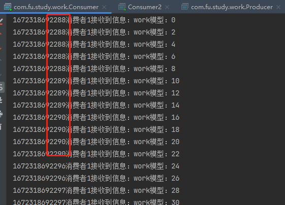
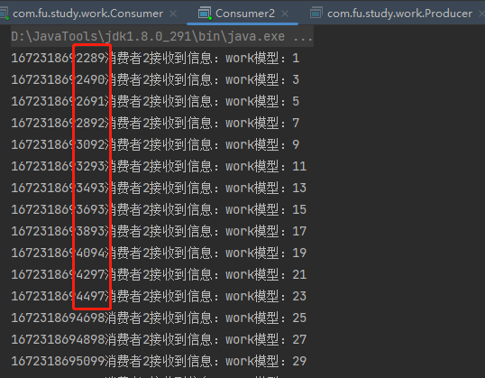
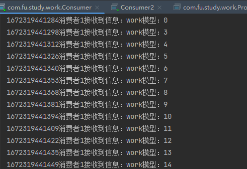
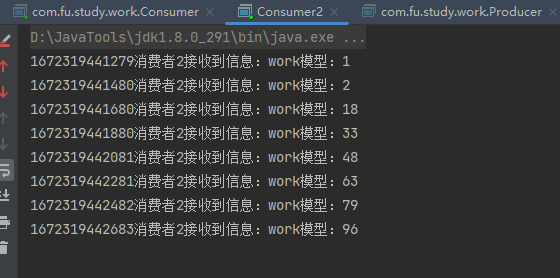

大家好，我是指北君。

今天指北君带领大家接着学习RabbitMQ，了解RabbitMQ的五大通信模型之一的Work模型；接下来还会有关于RabbitMQ的系列教程，对你有帮助的话记得关注哦~

<!--more-->

### 回顾

上一篇文章中，简单的介绍了一下RabbitMQ，以及安装和hello world。

有的小伙伴留言说看不懂其中的方法参数，这里先解释一下几个基本的方法参数。

````java
// 声明队列方法
channel.queueDeclare(QUEUE_NAME, false, false, false, null);
/**
 * param1：queue 队列的名字
 * param2：durable 是否持久化；比如现在发送到队列里面的消息，如果没有持久化，重启这个队列后数 据会丢失(false) true：重启之后数据依然在
 * param3：exclusive 是否排外(是否是当前连接的专属队列)，排外的意思是：
 *            1：连接关闭之后 这个队列是否自动删除（false：不自动删除）
 *            2：是否允许其他通道来进行访问这个数据（false：不允许）	
 * param4：autoDelete 是否自动删除
 *            就是当最后一个连接断开的时候，是否自动删除这个队列（false：不删除）
 * param5：arguments(map) 声明队列的时候，附带的一些参数
 */
````

````java
// 发送数据到队列
channel.basicPublish("", QUEUE_NAME, MessageProperties.PERSISTENT_TEXT_PLAIN, "第一个队列消息...".getBytes());
/**
 * param1：exchange  交换机  没有就设置为 "" 值就可以了
 * param2：routingKey 路由的key  现在没有设置key，直接使用队列的名字
 * param3：BasicProperties 发送数据到队列的时候，是否要带一些参数。
 * 		   MessageProperties.PERSISTENT_TEXT_PLAIN表示没有带任何参数
 * param4：body 向队列中发送的消息数据
 */
````

### Work模型

work模型称为工作队列或者竞争消费者模式，多个消费者消费的数据之和才是原来队列中的所有数据，适用于流量的削峰。



### 演示

写个简单的测试：

1. 生产者

   ```java
   public class Producer {
       private static final String QUEUE_NAME = "queue_work_1";
   
       public static void main(String[] args) throws IOException, TimeoutException {
           Connection connection = ConnectionUtils.getConnection();
           Channel channel = connection.createChannel();
           channel.queueDeclare(QUEUE_NAME, false, false, false, null);
           for (int i = 0; i < 100; i++) {
               channel.basicPublish("", QUEUE_NAME, null, ("work模型：" + i).getBytes());
           }
           channel.close();
           connection.close();
       }
   
   }
   ```

2. 消费者

   ```java
   // 消费者1
   public class Consumer {
       private static final String QUEUE_NAME = "queue_work_1";
   
       public static void main(String[] args) throws IOException, TimeoutException {
           Connection connection = ConnectionUtils.getConnection();
           Channel channel = connection.createChannel();
           channel.queueDeclare(QUEUE_NAME, false, false, false, null);
           // channel.basicQos(0, 1, false);
           DefaultConsumer defaultConsumer = new DefaultConsumer(channel) {
               @Override
               public void handleDelivery(String consumerTag, Envelope envelope, AMQP.BasicProperties properties, byte[] body) throws IOException {
                   System.out.println(System.currentTimeMillis() + "消费者1接收到信息：" + new String(body));
                   channel.basicAck(envelope.getDeliveryTag(), false);
               }
           };
           channel.basicConsume(QUEUE_NAME, false, defaultConsumer);
       }
   
   }
   ```

   ```java
   // 消费者2
   public class Consumer2 {
       private static final String QUEUE_NAME = "queue_work_1";
   
       public static void main(String[] args) throws IOException, TimeoutException {
           Connection connection = ConnectionUtils.getConnection();
           Channel channel = connection.createChannel();
           channel.queueDeclare(QUEUE_NAME, false, false, false, null);
           // channel.basicQos(0, 1, false);
           DefaultConsumer defaultConsumer = new DefaultConsumer(channel) {
               @Override
               public void handleDelivery(String consumerTag, Envelope envelope, AMQP.BasicProperties properties, byte[] body) throws IOException {
                   System.out.println(System.currentTimeMillis() + "消费者2接收到信息：" + new String(body));
                   channel.basicAck(envelope.getDeliveryTag(), false);
                   // 这里加了个延迟，表示处理业务时间
                   try {
                       Thread.sleep(200);
                   } catch (InterruptedException e) {
                       e.printStackTrace();
                   }
               }
           };
           channel.basicConsume(QUEUE_NAME, false, defaultConsumer);
       }
   }
   ```

3. 结果

   



可以看出来：100条消息，消费者之间是平分的，消费者1 几乎是瞬间完成，消费者2 则是慢慢吞吞的运行完毕，消费者1大量时间处于空闲状态，消费者2则一直忙碌。这显然是不适用于实际开发中。

我们需要遵从一个原则，就是 **能者多劳** ，消费越快的人，消费的越多；

现在我们把消费者1和2的代码中 `// channel.basicQos(0, 1, false);` 这行代码取消注释，再次运行；





现在的结果就比较符合能者多劳，虽然你干的多，但是工资是一样的呀~

work模型的一个主要的方法是`basicQos()`；这里也解释一下其参数：

````java
// 设置限流机制
channel.basicQos(0, 1, false);
/**  
 *  param1: prefetchSize，消息本身的大小 如果设置为0  那么表示对消息本身的大小不限制
 *  param2: prefetchCount，告诉rabbitmq不要一次性给消费者推送大于N个消息
 *  param3：global，是否将上面的设置应用于整个通道，false表示只应用于当前消费者
 */
````

### 小结

本文到这里就结束了，主要介绍了RabbitMQ通信模型中的work模型，适用于限流、削峰等应用场景。

后续指北君还会继续更新RabbitMQ的系列文章，感兴趣的小伙伴持续关注哦~

>[RabbitMQ（一）hello world，链接未补充]()
