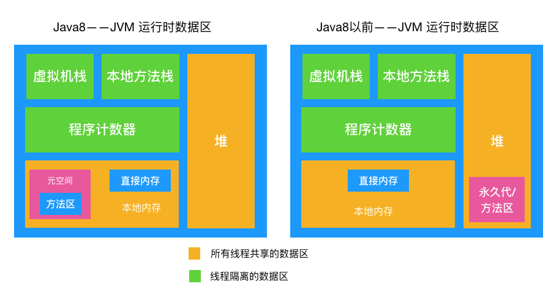

哈喽，大家好，我是了不起。  

在我们的日常编程实践中，我们经常会遇到各种类型的对象，比如字符串、列表、自定义类等等。这些对象在内存中是如何存储的呢？

你可能会毫不犹豫地回答：“在堆中！”如果你这样回答了，那你大部分情况下是正确的。但是，有没有例外呢？Java中的对象一定在堆中分配吗？

接下来，了不起带你揭开Java内存模型的神秘面纱。


<!--more-->

### 1、Java内存模型简介

Java内存模型是Java虚拟机（JVM）的一部分，它规定了JVM如何和计算机内存进行交互。Java内存模型主要包括五个部分：



1. 堆（Heap）：这是运行时数据区域，所有的对象实例以及数组都在这里分配内存。
2. 栈（Stack）：每个线程有一个私有的栈，每次方法调用都会在栈上创建一个栈帧，用于存储局部变量、操作数栈、动态链接、方法出口等信息。
3. 方法区（Method Area）：所有的类信息、常量、静态变量以及即时编译器编译后的代码都被存储在方法区。
4. 本地方法栈（Native Method Stack）：对于执行Native方法，JVM使用本地方法栈。
5. 程序计数器（Program Counter Register）：程序计数器是当前线程所执行的字节码的行号指示器。

当我们在代码中创建一个新的对象时，这个对象的内存通常是在堆上分配的。然后我们可以在栈上的方法帧中保存对这个对象的引用。这是对象内存分配的常规方式，但是并不是唯一的方式。


### 2、对象的常规分配策略

在Java中，新创建的对象通常会被分配在堆中。这是因为堆是由所有线程共享的，任何线程都可以访问到堆中的任何对象，只要它有这个对象的引用。此外，堆的大小只受到物理内存大小的限制，可以容纳大量的对象。

以下是一个简单的代码示例，展示了在堆中创建一个新对象：

```java
public class Main {
    public static void main(String[] args) {
        String str = new String("Hello, world!");  // 在堆上分配一个新的 String 对象
        // ...
    }
}
```

在这个示例中，我们使用 `new` 关键字在堆上创建了一个新的 `String` 对象。然后我们在栈上的 `main` 方法帧中保存了一个对这个对象的引用。


### 3、对象的逃逸分析和标量替换

然而，Java虚拟机不总是在堆上分配对象。有一种被称为“逃逸分析”（Escape Analysis）的技术，可以帮助JVM判断一个新创建的对象的引用是否会逃逸出方法（即是否可能被其他方法或线程引用）。如果一个对象只在一个方法中使用，并且不会逃逸出这个方法，那么JVM可能会选择在栈上分配这个对象。

另外一种叫做"标量替换"（Scalar Replacement）的优化手段，如果一个对象不可能逃逸出方法，并且这个对象的所有字段都可以被访问到，那么JVM可能会选择拆解这个对象，直接在栈上创建一些对应的基本类型变量。

然而，这些都取决于JVM的实现和具体的运行情况，所以并不能保证在所有情况下都有效。此外，这些优化通常需要启动JVM的-server模式才能生效。


### 4、Java堆和栈的对比

堆和栈在Java内存模型中扮演着非常重要的角色，它们各自有着自己的特性和用途。简单来说：

- **堆（Heap）**：Java堆是所有线程共享的一块内存区域，主要用于存放对象实例和数组。堆是动态分配的，大小不固定，只受物理内存大小限制。
- **栈（Stack）**：Java栈是线程私有的，每个方法执行都会创建一个新的栈帧。栈帧用于存储局部变量、操作数栈、动态链接、方法出口等信息。栈的大小在虚拟机启动时就已经确定。

在Java中，对象的分配主要依赖于它们是否可能被其他方法或线程所引用，即是否会“逃逸”。

- 如果一个对象的生命周期仅限于一个方法，并且不会被其他方法或线程引用，那么它可能在栈上分配。这通常是通过逃逸分析实现的。
- 如果一个对象可能被多个线程共享，或者它的生命周期可能超过创建它的方法，那么它会被分配在堆上。


### 5、实际应用和优化

在实际的编程实践中，我们通常不需要关心对象是在堆上分配还是在栈上分配，因为这是由JVM自动管理的。然而，理解这些概念有助于我们编写出更高效、更优化的代码。

例如，我们可以尽量限制对象的作用域，让它们只在一个方法中存在，这样就增加了它们在栈上分配的可能性。这样做的另一个好处是提高了代码的可读性和可维护性。

JIT编译器也会进行一些优化，比如通过逃逸分析和标量替换技术，来提高代码的运行效率。理解这些优化策略可以帮助我们更好地理解代码的执行过程，提高我们的编程技能。


### 6、结论

通过以上的讨论，我们可以回答这个问题：Java中的对象一定在堆中分配吗？

答案是：**不一定**。

在Java中，对象通常是在堆上分配的，因为堆是一个由所有线程共享的内存区域，它可以容纳大量的对象。但是，如果JVM通过逃逸分析发现一个对象只在一个方法中使用，并且不会逃逸出这个方法，那么它可能会选择在栈上分配这个对象。同样的，如果一个对象可以被拆解为一些基本类型或引用类型的字段，并且这些字段都只在一个方法中使用，那么JVM可能会选择进行标量替换，将这个对象拆解并在栈上分配。

这些优化策略取决于JVM的具体实现和运行情况，因此并不是在所有情况下都有效。在实际的编程实践中，我们通常不需要关心对象是在堆上分配还是在栈上分配，因为这是由JVM自动管理的。然而，理解这些概念和优化策略可以帮助我们编写出更高效、更优化的代码。