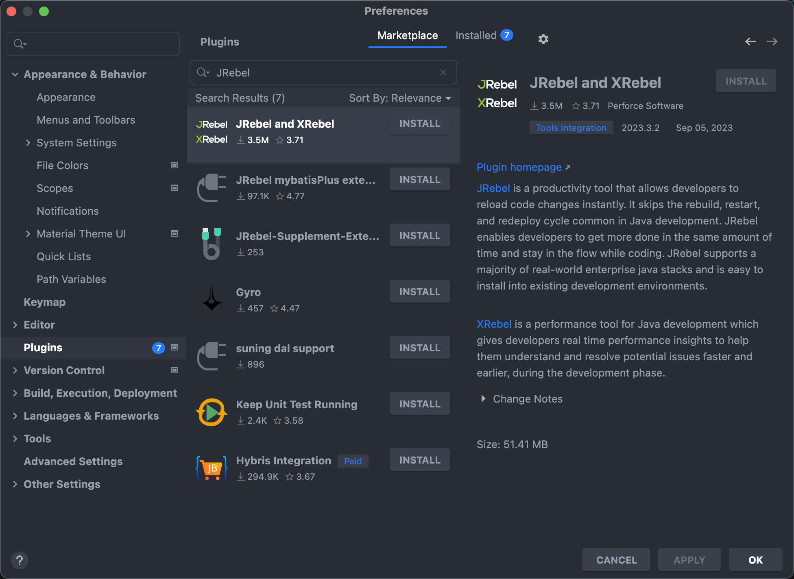

哈喽，大家好，我是了不起。  

热部署是软件开发中一个非常有用的功能，它允许我们在不重新启动整个应用的情况下，依旧能够使我们修改的代码生效。

现在Java Web 开发应该都是使用的 SpringBoot，那么本篇文章就来介绍SpringBoot 如何实现热部署？

<!--more-->

### 1、热部署的优点

开发周期通常包括编写代码、编译、部署和测试几个步骤。在一个快速发展的项目中，这个周期需要尽可能地缩短。热部署能让开发者在代码更改后立即看到结果，从而加速开发和测试过程。

除了加速开发，热部署也让应用的调试变得更为方便。传统的调试方法往往需要开发者手动停止和重启应用，这不仅效率低，而且可能会导致调试信息丢失。热部署则允许你在应用运行时直接应用代码更改，使得调试过程更为顺畅。

还有在多人开发环境中，团队成员需要经常合并代码并解决冲突。有了热部署，开发者可以更快地看到合并后的代码效果，大大简化了多人协作的复杂性。


### 2、热部署的实现方式

#### 2.1 使用 Spring Boot DevTools

Spring Boot DevTools 是 Spring Boot 官方提供的一个模块，专门用于提高开发效率。你可以非常简单地通过添加一个 Maven 或 Gradle 依赖到你的项目中来启用这个功能。

Maven 依赖：

```xml
<dependencies>
    <!-- 其他依赖 -->
    <dependency>
        <groupId>org.springframework.boot</groupId>
        <artifactId>spring-boot-devtools</artifactId>
        <scope>runtime</scope>
        <optional>true</optional>
    </dependency>
</dependencies>
```


Gradle 依赖：

```xml
dependencies {
    // 其他依赖
    developmentOnly 'org.springframework.boot:spring-boot-devtools'
}
```


一旦我们添加了 DevTools 的依赖，Spring Boot 就会自动配置一系列开发时的功能，其中最重要的就是代码热部署。具体来说，每当你保存一个文件的更改，DevTools 就会自动重新启动应用的相关部分。这个“重新启动”是非常快速的，因为它只重新加载了更改的类，而不是整个应用。


#### 2.2 使用 JRebel

JRebel 是一款优秀的 Java 开发效率工具，它可以实现代码的热部署。不过需要注意的是，JRebel 是一个商业产品，需要购买许可证。

要使用 JRebel，首先需要在你的 IDE（如 IntelliJ IDEA 或 Eclipse）中安装 JRebel 插件。安装完成后，按照 JRebel 的文档来进行相应的配置即可。



JRebel 使用一种称为“类重定义（Class Redefinition）”的技术来实现热部署。具体来说，当你更改了代码并保存后，JRebel 会自动找到这个类的新版本，并替换正在运行的应用中的旧版本。

这里的热部署不仅局限于 Java 类，还支持如 XML、HTML、JavaScript 等其他类型的文件。


### 3、注意事项

热部署虽好，但并不是万能的。首先，热部署主要是为开发环境设计的，不应用于生产环境。使用热部署在生产环境中可能引发不可预知的问题。所以在生产环境要关掉热部署。

另外并非所有类型的更改都可以通过热部署来应用。例如，对于数据库结构的更改或是 JVM 启动参数的修改通常都需要完全重启应用。