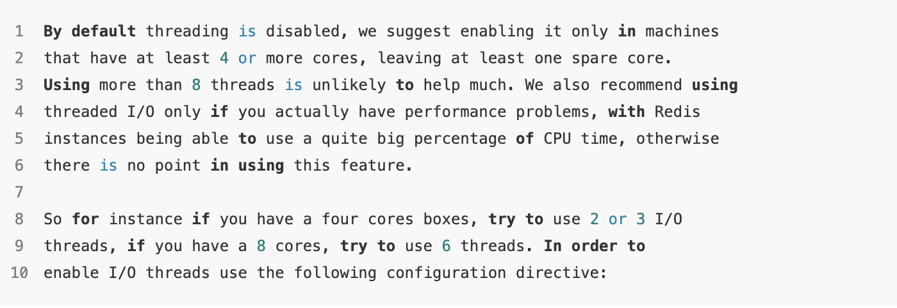

哈喽，大家好，我是了不起。  

我还依稀记得刚开始学Redis时，就有一个深入骨髓的概念，Redis之所以快是因为其是单线程的，那么处理数据时不用考虑多线程之间的上下文切换问题。而且单线程也不用考虑多线程的数据竞争，类似加锁等安全问题。

好，请看下图：

<!--more-->



Redis6.0 官方文档 redis.conf 中的介绍:

多线程默认是不开启的，CPU 4 核以上，才考虑开启多线程，其中：

- 4 核开启 2 - 3 个 IO 线程
- 8 核 开启 6 个 IO 线程
- 超过 8 个 IO 线程，性能提升已经不大

也就是说：Redis 开始开启多线程了？

其实看仔细点也能知道，多线程被用于网络I/O处理，而不是数据操作。这意味着实际的命令执行仍然是单线程的，保持了Redis操作的原子性和简单性。多线程主要用于在接收到命令和发送响应时，进行网络数据的读取和写入。

### 1、为什么要开启多线程？

#### 1.1 充分利用多核CPU

现代服务器通常配备多核CPU，单线程的Redis无法充分利用多核的优势。引入多线程后，Redis可以在不同的核心上并行处理网络请求和读写操作，从而提高性能。

#### 1.2 提高网络I/O效率

在单线程模型中，网络I/O操作（如读取和写入数据到客户端）可能成为瓶颈。通过多线程处理这些操作，Redis能更高效地处理大量的并发连接和数据传输。

#### 1.3 响应现代应用需求

随着现代应用对数据处理速度要求的提高，需要数据库能够快速响应更多并发请求。多线程使Redis更适合高并发、高吞吐量的应用场景。


### 2、多线程实现

Redis的源代码是用C语言编写的。下面是一个简化的例子，展示了如何在C语言中创建多线程。请注意，这不是实际的Redis代码，但可以提供一个基本概念：

```c
#include <pthread.h>
#include <stdio.h>

void *threadFunction(void *arg) {
    printf("In thread\n");
    // 这里执行线程的任务，例如处理网络I/O
    return NULL;
}

int main() {
    pthread_t thread_id;
    printf("Before Thread\n");
    pthread_create(&thread_id, NULL, threadFunction, NULL);
    pthread_join(thread_id, NULL);
    printf("After Thread\n");
    return 0;
}
```

在这个例子中，我们使用`pthread_create`函数创建了一个新线程，然后在`threadFunction`函数中执行任务。

Redis 6.0通过引入多线程处理网络I/O，成功地解决了单线程模型在高并发环境下的性能瓶颈，同时保持了数据处理的原子性和一致性。

但是我们在使用Redis这一新的性能时要注意配置文件的开启。


