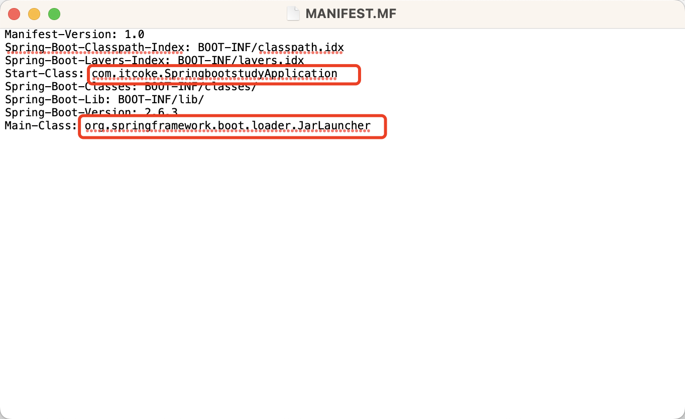

哈喽，大家好，我是了不起。  

现在Java Web 开发应该都是使用的 SpringBoot，部署的时候直接打包成jar包运行即可。

但是之前用SSH或SSM开发的时候，通常是打包成war包，然后部署到类似Tomcat的web服务器运行。

那么问题来了：为什么 SpringBoot 的 jar 包可以直接运行呢？

<!--more-->

### 1、Fat jar 

和普通的 jar 包结构不同，通过 SpringBoot 打包而成的 jar 包是 Fat jar（**胖 JAR**），在 BOOT-INF/lib 目录下，包含了项目依赖的全部jar 包。在 BOOT-INF/classes 目录下，包含了项目运行的class文件。

这意味着这个 JAR 文件不仅包含了应用的代码，还包括了所有必要的依赖库。这样做的好处就是，我们不需要在运行环境中单独安装这些库了，因为它们已经包含在 JAR 文件中了。


可能会有人问，是如何打包成这种方式的呢？

通常在我们的构建文件中，比如pom.xml 文件：

```xml
<project>
    <!-- ... 其他配置 ... -->
    <build>
        <plugins>
            <plugin>
                <groupId>org.springframework.boot</groupId>
                <artifactId>spring-boot-maven-plugin</artifactId>
            </plugin>
        </plugins>
    </build>
</project>
```

当我们执行 `mvn package` 命令时，它会创建一个包含所有依赖的 JAR 文件。


### 2、内嵌服务器

Spring Boot 应用通常内嵌了一个服务器（如 Tomcat）。这是通过在 `pom.xml` 或 `build.gradle` 文件中添加相应的依赖实现的。

例如，以下是一个包含 Spring Boot 与 Tomcat 依赖的 `pom.xml` 片段：

```xml
<dependencies>
    <dependency>
        <groupId>org.springframework.boot</groupId>
        <artifactId>spring-boot-starter-web</artifactId>
    </dependency>
    <!-- ... 其他依赖 ... -->
</dependencies>
```

当 Spring Boot 应用启动时，它会自动配置并启动这个内嵌的 Tomcat 服务器。


### 3、**Spring Boot 启动器**

每个 Spring Boot 应用都有一个入口类，这个类包含了 `main` 方法，它是整个应用启动的起点。这个类使用 `@SpringBootApplication` 注解，这个注解是一个方便的注解，集成了 `@Configuration`、`@EnableAutoConfiguration` 和 `@ComponentScan`。例如：

```java
import org.springframework.boot.SpringApplication;
import org.springframework.boot.autoconfigure.SpringBootApplication;

@SpringBootApplication
public class MyApplication {
    public static void main(String[] args) {
        SpringApplication.run(MyApplication.class, args);
    }
}
```

当运行这个应用时，`SpringApplication.run()` 方法会启动 Spring 应用上下文，并且启动内嵌的服务器。


### 4、**可执行 JAR 文件**

在构建的 JAR 文件中，`META-INF/MANIFEST.MF` 文件指定了主类（Main-Class）。

当我们使用 `java -jar` 命令运行 JAR 文件时，Java 虚拟机就知道从哪个类的 `main` 方法开始执行。



这里的`Main-Class`是Spring Boot的JarLauncher，它是负责启动整个Spring Boot应用程序的类。

大家可以追踪一下源码：

```java
protected void launch(String[] args) throws Exception {
   JarFile.registerUrlProtocolHandler();
   //自定义类加载器加载jar文件
   ClassLoader classLoader = createClassLoader(getClassPathArchives());
   //关注getMainClass方法
   launch(args, getMainClass(), classLoader);
}
```


```java
@Override
protected String getMainClass() throws Exception {
   Manifest manifest = this.archive.getManifest();
   String mainClass = null;
   if (manifest != null) {
      mainClass = manifest.getMainAttributes().getValue("Start-Class");
   }
   if (mainClass == null) {
      throw new IllegalStateException("No 'Start-Class' manifest entry specified in " + this);
   }
   return mainClass;
}
```

