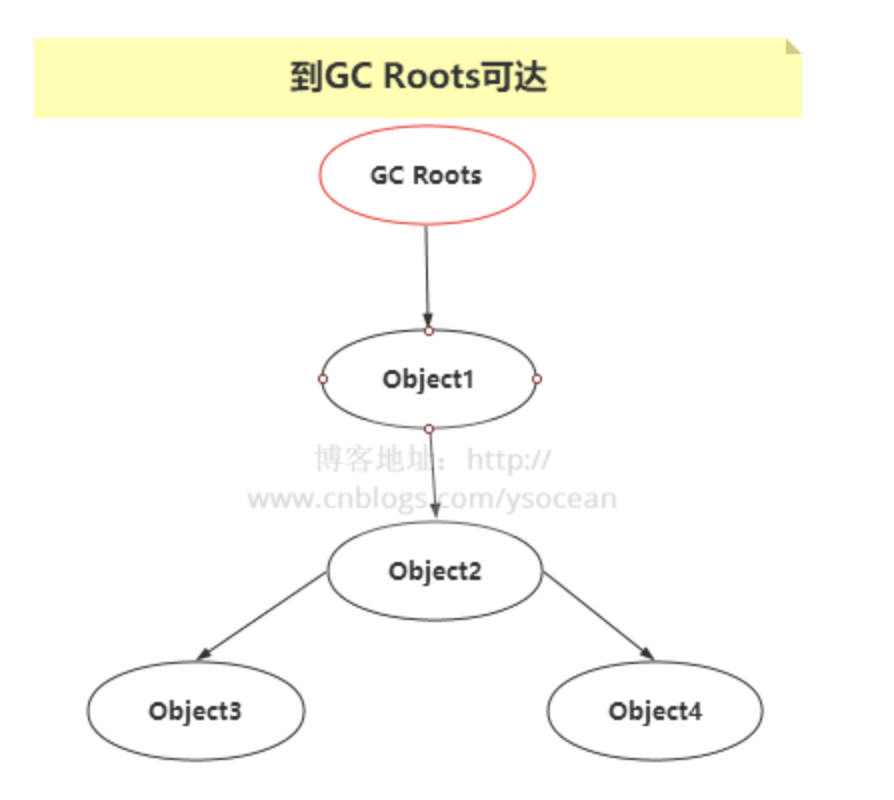

哈喽，大家好，我是了不起。  

相信大家在面试Java开发的时候，会遇到比较多的问题是Java的内存管理，这里面涉及到Java垃圾回收机制，以及JVM调优等等，那么今天跟大家讨论一个问题：Java对象不再使用时，为什么要赋值为 null ？

<!--more-->

### 1、Java内存管理

在Java中，对象是在堆内存中分配的。

这部分内存用于存储所有运行时创建的对象，不论是类的实例还是数组。所以我们常说的Java垃圾回收，其实就是回收堆内存的垃圾对象。

而在Java虚拟机（JVM）有一个垃圾回收器，它负责自动清理不再使用的对象，以释放和回收内存。

GC的工作基于对象的可达性分析，即从一组称为“根”的对象开始，通过引用关系检查哪些对象是可达的。不可达的对象被认为是不再使用的，因此可以被GC清理。

PS：有的语言垃圾回收算法是引用计数法，简单来说就是计算一个对象有多少个引用，如果对象引用为0时，那么该对象会判定为垃圾进行回收，但是会有循环引用的问题，比如三个无用对象互相引用，计算引用个数一直会是1。

### 2、为什么要将对象赋值为 `null`？

当你明确知道一个对象不会再被使用时，通过将引用设置为 `null`，你可以显式地告诉垃圾回收器这个对象现在可以被回收。这是一种代码层面的优化，尤其在处理大型对象或在内存有限的环境中非常有用。

另外，在某些情况下，即使对象已经不再需要，但由于仍存在对它的引用，垃圾回收器不会清理这个对象。这可能导致内存泄漏。将引用设置为 `null` 可以防止这种情况的发生。

还有一种人性化设置，就是将对象设置为 `null` 也是一种清晰的信号，表明该对象的生命周期已经结束。这对于阅读和维护代码的人来说是一个有用的信息。

### 3、何时将对象赋值为 `null`？

大概有两种：

1. **长生命周期的对象**：对于在应用程序中存在较长时间的对象，尤其是那些占用大量内存的对象，在不再需要时将其设置为 `null` 是一个好习惯。
2. **作用域较大的变量**：如果一个变量在方法或类中有较大的作用域，但只在特定部分使用，之后不再需要，将其设置为 `null` 可以减少内存占用。

### 4、注意事项

1. **自动回收**：在许多情况下，当对象的引用超出作用域时，你不需要显式地将对象设置为 `null`。Java的垃圾回收机制会自动处理这些情况。
2. **过度使用**：不必要地或过度地使用 `null` 赋值可以导致代码混乱和错误。只有在明确需要时才这样做。
3. **空指针异常**：设置为 `null` 的引用如果被不慎使用，可能会导致空指针异常（NullPointerException）。在使用任何引用之前，进行空检查是一个好习惯。

