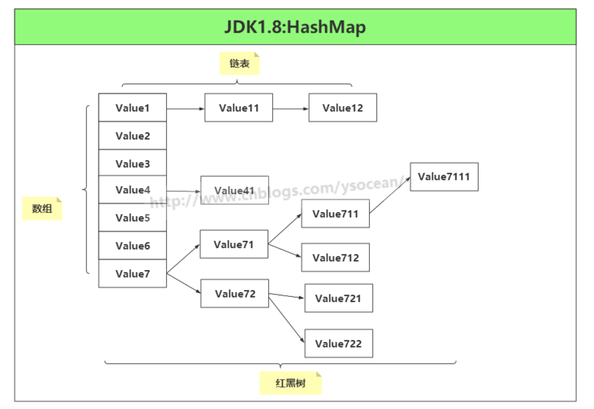
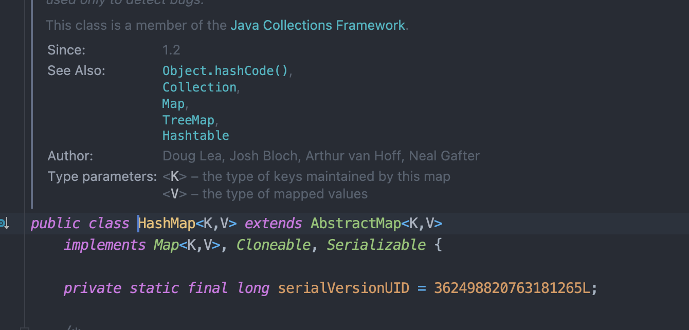

哈喽，大家好，我是了不起。  

做Java开发的人，应该都用过 HashMap 这种集合。

今天就和大家来聊聊，为什么 HashMap 是线程不安全的。

<!--more-->

### 1、HashMap 数据结构

简单来说，`HashMap` 基于哈希表实现。它使用键的哈希码来决定该键值对应该存储在哈希表的哪个位置。在 `HashMap` 中：

- 键对象的 `hashCode()` 方法用于计算哈希码。
- 如果多个键有相同的哈希码或不同的哈希码映射到同一位置，`HashMap` 会使用红黑树结构来处理这种冲突。

该类实现了一个 Map 接口，该接口定义了一组键值对映射通用的操作。储存一组成对的键-值对象，提供key（键）到value（值）的映射，Map中的key不要求有序，不允许重复。value同样不要求有序，但可以重复。

### 2、线程安全的含义

线程安全通常意味着在多线程环境中，多个线程可以同时访问同一个资源（如数据结构、文件等），而不引发任何问题，例如数据损坏、不一致或非预期的行为。为了保证线程安全，通常需要通过同步机制来协调不同线程对资源的访问。

### 3、为什么 `HashMap` 是线程不安全的

1. **并发修改导致的数据不一致**：如果多个线程同时修改 `HashMap`，可能会导致内部数据结构的不一致。例如，在扩容过程中（当 `HashMap` 中的元素数量超过其容量和负载因子的乘积时，它会进行扩容），如果有多个线程同时插入数据，可能会造成链表循环、数据丢失等问题。
2. **快速失败迭代器**：`HashMap` 的迭代器是快速失败（fail-fast）的，意味着在迭代过程中如果检测到结构上的任何修改，迭代器会立即抛出 `ConcurrentModificationException`。在多线程环境中，这种异常更常见。
3. **无同步机制**：`HashMap` 没有内置的同步机制来防止多个线程同时写入或读取时可能导致的问题。

### 4、替代方案

由于 `HashMap` 是线程不安全的，因此在需要线程安全的场景中，建议使用其他数据结构，如：

- **`Hashtable`**：它是一个古老的数据结构，与 `HashMap` 类似，但它的每个方法都是同步的，这会导致性能问题。
- **`Collections.synchronizedMap()`**：通过这个方法可以将 `HashMap` 包装为线程安全的，但同样会有性能影响。
- **`ConcurrentHashMap`**：这是一个专为多线程环境优化的哈希表，提供了更好的并发性能，同时减少了锁竞争。

