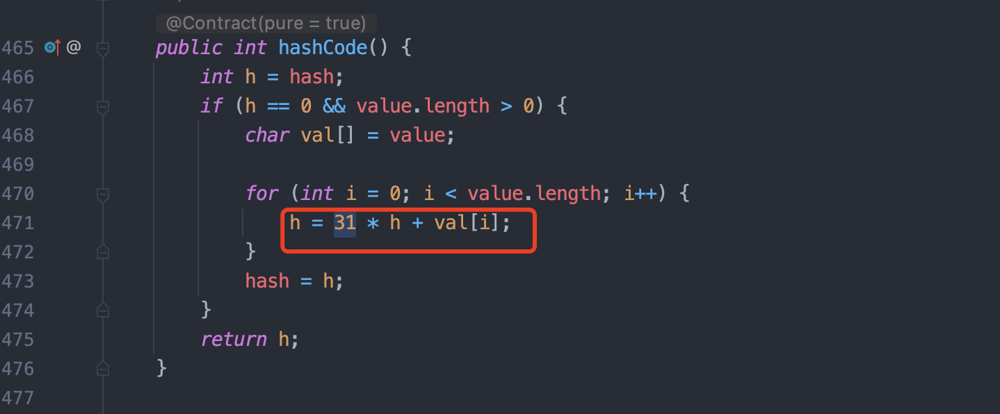

哈喽，大家好，我是了不起。 

今天给大家介绍一个底层数字问题——为什么Java String哈希函数乘数为31？ 

<!--more-->

### 1、源码重现

在这个实现中，`31` 被用作乘数。那么，为什么选择 31 作为乘数呢？

### 2、降低哈希冲突

31 是一个质数，相信大家学过数学的，质数是这样定义的：

> 指在大于1的自然数中，除了1和它本身以外没有任何正因数的自然数。

在哈希函数中，使用质数作为乘数可以提高哈希值的分布均匀性。如果使用非质数作为乘数，那么哈希值的分布可能会出现偏斜。

例如，如果使用 10 作为乘数，那么所有以 5 为尾数的字符串的哈希值将是相同的。这会导致哈希冲突的可能性增加。

### 3、提高哈希计算速度

在 Java 中，`int` 类型的变量占用 32 位。

31 是一个奇数，因此 31 * i 的结果可以只使用 31 位来表示。这意味着在计算哈希值时，可以使用位运算来代替乘法运算。

位运算比乘法运算要快得多。

因此，使用 31 作为乘数可以提高哈希计算速度。

### 4、**31是一个良好的折中方案**

在实际应用中，使用 31 作为乘数可以提供良好的哈希值分布和计算速度。当然，也可以使用其他质数作为乘数。例如，37 和 43 也是不错的选择。

但是，31 是一个相对较小的质数，因此它在计算速度方面具有优势。此外，31 也是一个常用的质数，因此在许多其他哈希函数中也得到了使用。

当然，31 并不是一个完美的乘数。在某些情况下，使用其他质数可能会更好。但是，对于大多数应用程序来说，31 都是一个不错的选择。
