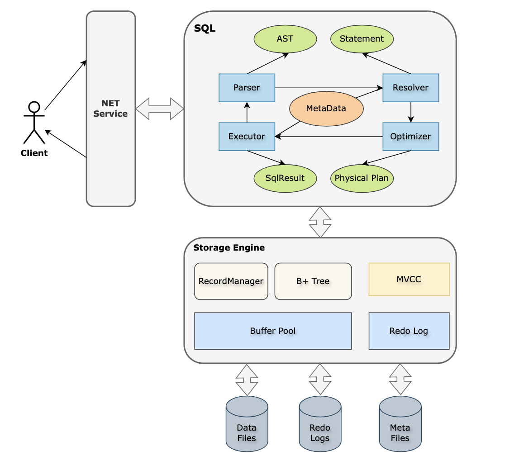

哈喽，大家好，我是了不起。  

作为一个后端开发人员，应该没有不接触数据库的，数据库操作优化也是后端面试人员的重点面试项目，那么如何学习数据库呢？

<!--more-->

在这个数据驱动的时代，几乎每个行业都在使用大量数据来做出决策、改善服务和创新产品。学习数据库往小了说是应对工作需要，面试需要，往大了说不仅是为了追赶技术潮流，更是因为它在现代社会中的重要性日益突出。

因为数据是很重要的，数据库是存储、检索、分析和管理数据的系统。在零售业到医疗保健，从小型企业到大型企业，无处不在。通过学习数据库，你可以理解数据是如何被组织和管理的，以及如何有效地从大量数据中提取有价值的信息。

而且掌握数据库相关的技能可以打开许多职业大门。数据科学家、数据库管理员、系统分析师和更多技术职位都需要数据库知识。这些技能被广泛认为是高需求且薪酬优厚的，因为每个依赖数据的公司都需要专业人员来管理和解释其数据。数据库不仅仅是技术人员的工具。它们为管理层提供了支持决策的数据洞察。学习如何使用数据库可以帮助你理解数据背后的故事，从而在你的工作中做出更加明智的决策。

今天了不起在逛GitHub开源项目的时候，发现这个项目简直就是专为零基础同学设计的数据库入门项目-MiniOB。

> MiniOB 是 OceanBase 团队基于华中科技大学数据库课程原型，联合多所高校重新开发的、专为零基础的同学设计的数据库入门学习项目。MiniOB 的目标是为在校学生、数据库从业者、爱好者或对基础技术感兴趣的人提供一个友好的数据库学习项目，更好地将理论、实践进行结合，提升同学们的工程实战能力。

地址：https://github.com/oceanbase/miniob

MiniOB 整体代码简洁，容易上手，设计了一系列由浅入深的题目，能够很好的帮助我们从零基础入门，迅速了解数据库并深入学习数据库内核。MiniOB 简化了许多模块，例如不考虑并发操作、安全特性和复杂的事务管理等功能，以便更好地学习数据库实现原理。

### 1、MiniOB 整体架构

- 网络模块(NET Service)：负责与客户端交互，收发客户端请求与应答；
- SQL解析(Parser)：将用户输入的SQL语句解析成语法树；
- 语义解析模块(Resolver)：将生成的语法树，转换成数据库内部数据结构；
- 查询优化(Optimizer)：根据一定规则和统计数据，调整/重写语法树。(部分实现)；
- 计划执行(Executor)：根据语法树描述，执行并生成结果；
- 存储引擎(Storage Engine)：负责数据的存储和检索；
- 事务管理(MVCC)：管理事务的提交、回滚、隔离级别等。当前事务管理仅实现了MVCC模式，因此直接以MVCC展示；
- 日志管理(Redo Log)：负责记录数据库操作日志；
- 记录管理(Record Manager)：负责管理某个表数据文件中的记录存放；
- B+ Tree：表索引存储结构；
- 会话管理：管理用户连接、调整某个连接的参数；
- 元数据管理(Meta Data)：记录当前的数据库、表、字段和索引元数据信息；
- 客户端(Client)：作为测试工具，接收用户请求，向服务端发起请求。

### 2、在线开发平台

我们知道搭建开发环境是一个比较耗时而且繁琐的事情，特别是对于初学者。

该项目为了让大家更快地上手 MiniOB，本仓库基于 Gitpod 建立了快速在线开发平台。

> https://gitpod.io/#https://github.com/oceanbase/miniob

