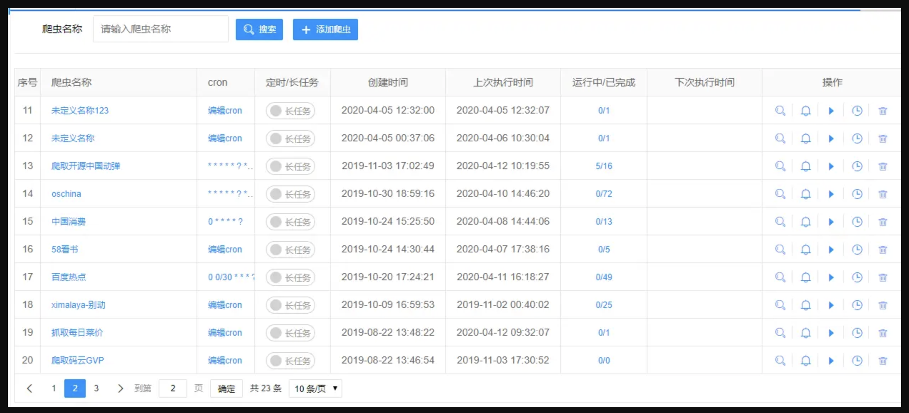

哈喽，大家好，我是了不起。  

爬虫，也被称为网络爬虫或网络蜘蛛，是一种自动化的网络机器人，其主要功能是按照一定的规则，自动浏览互联网并从网页中提取信息。

作为一个开发人员，相信大家都尝试过写一些爬虫，合理的利用一些爬虫工具，对于我们一些还是挺有帮助的。

比如自动化测试，使用爬虫技术对网站进行自动化测试，检查链接是否有效，确保网站内容的正确显示。

今天就给大家介绍一款开源的爬虫工具，不用写代码即可完成爬虫。

<!--more-->

话不多说，直接看网址：

> https://github.com/ssssssss-team/spider-flow

### Spider-Flow

Spider-Flow，由ssssssss-team开发的开源爬虫工具，以其独特的图形化定义流程和强大的功能集成，突破了传统编码方式的限制，使得爬虫的创建和管理变得前所未有的简单。

设计理念是使爬虫开发工作变得可视化且易于操作，这一点通过其提供的丰富功能和用户友好的界面得到了很好的实现：

1. **图形化流程设计**：用户通过拖放组件即可设计复杂的爬虫任务，无需编写任何代码。
2. **支持多种数据提取方式**：包括Xpath、JsonPath、CSS选择器和正则表达式，用户可以根据需要灵活选择。
3. **数据处理与存储**：支持JSON、XML和二进制格式，可以将数据自动保存至数据库或文件系统。
4. **动态内容爬取**：能够处理JavaScript动态渲染的页面，确保从动态内容中也能有效抓取数据。
5. **扩展性和自定义功能**：提供插件支持，如Selenium、Redis等，并允许用户自定义方法和执行器，极大增强了其灵活性。

Spider-Flow不仅是一款工具，更是一个活跃的社区。用户可以通过社区分享自己的爬虫案例，同时获取其他开发者的经验和支持。此外，项目的文档和Demo站点提供了丰富的学习资源，帮助新用户快速上手。

### Debug

制作爬虫的时候支持 Debug 模式。

### 日志

查看日志也特别方便。

最后说一句，虽然Spider-Flow极大简化了爬虫开发的复杂度，但开发团队也强调了合法合规的使用原则。

所以我们在使用Spider-Flow时，需要确保其爬虫任务不违反任何法律和道德约束，避免将其用于非法用途。
